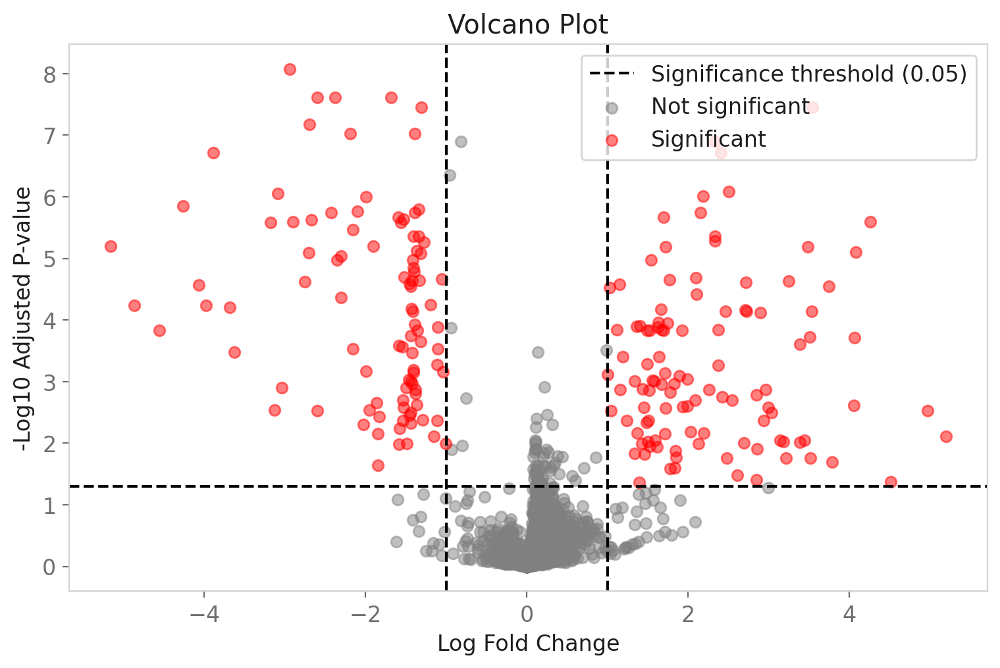

# DEConcord

[](https://github.com/nezihcandikme/DeConcord/actions/workflows/tests.yml)
[](pyproject.toml)
[](LICENSE)

Robustness and concordance analysis for RNA-seq differential expression.

Most RNA-seq workflows report the significant genes or pathways from one particular analysis configuration. DEConcord asks whether those conclusions remain stable when reasonable analytical decisions change — a different DE tool, a different significance threshold, a different resampling of the same data.

Not a DESeq2/edgeR replacement, and not trying to be. DEConcord doesn't run its own differential expression as its main job — it takes DE result tables (from DESeq2, edgeR, or anything with a gene ID, a log fold change, and a p-value) and tells you how much to trust them when they disagree.

**Status**: early, pre-1.0 (v0.13.1), under active development. The core method-concordance question is implemented and checked against real data (see [Validation](#validation)); threshold sensitivity, pathway stability, and resampling stability are on the [roadmap](#roadmap), not yet built.

## Quick start

```bash
git clone https://github.com/nezihcandikme/DeConcord.git
cd DeConcord
pip install -e .
```

Compare two DE result tables — here, real DESeq2 and edgeR output on the same count matrix:

```python
import pandas as pd
from deconcord.concordance.methods import compute_de_concordance

deseq2 = pd.read_csv("deseq2_results.csv", index_col="gene_id")
edger = pd.read_csv("edger_results.csv", index_col="gene_id")

result = compute_de_concordance(
    deseq2, edger, name_a="DESeq2", name_b="edgeR",
    lfc_col_a="log2FoldChange", pvalue_col_a="padj",
    lfc_col_b="logFC", pvalue_col_b="FDR",
)

result["summary"]["jaccard_index"]          # significant-gene set overlap
result["summary"]["directional_agreement"]  # among genes sig. in both, % same direction
result["discordant_genes"]                  # significant in both, but disagree on direction
```

The underlying pipeline (validation → QC → normalization → DE → enrichment) is still there and still real — `deconcord counts.csv --group1 ... --group2 ...` on the CLI, or `deconcord.pipeline.run_analysis` as a library call. Supported input: a CSV count matrix, genes as rows and samples as columns, non-negative integer values — the CLI and `run_analysis` both validate this up front and name the specific problem if it isn't (wrong orientation, duplicate gene IDs, missing values) rather than failing deep inside a later step.

A CLI run writes:

```
deconcord_output/
├── tables/differential_expression.csv, qc.csv, ...
├── figures/volcano.png, pca.png, ...
└── run_metadata.json   # version, parameters, timestamp -- for reproducing the run
```



*Volcano plot from an actual `deconcord` CLI run on a synthetic dataset — every point is a gene that was really tested, not a mockup.*

For the full workflow in one runnable script — generate data, load, validate, run two DE methods, check their concordance, plot — see [`examples/quickstart.py`](examples/quickstart.py) (`python examples/quickstart.py`, no network or R required).

## Why

I'm a high-school student learning statistics and computational biology. This project started as a general bulk RNA-seq pipeline (validation, QC, normalization, a from-scratch differential expression implementation) — useful for learning the mechanics, but a narrower question turned out to be more interesting and more honest about what a small project can actually contribute: not "can I build another DE tool" (mature platforms like [OmicVerse](https://github.com/Starlitnightly/omicverse) already do that, with a published paper and years of development behind them), but "how much do the conclusions from *existing* tools actually hold up when you stress-test them." That question doesn't require out-building anything — it requires being careful.

The code running is step one. The numbers meaning what I think they mean is the actual objective. The dated account of what changed, why, and what didn't work — including the reasoning behind this rename — is in [`DEVLOG.md`](DEVLOG.md).

## What it does

The intended workflow, once every stage exists:

```
DE result tables (DESeq2, edgeR, ...)
        ↓
method concordance          ← built (compute_de_concordance)
        ↓
threshold sensitivity       ← not built yet
        ↓
pathway enrichment + pathway stability   ← enrichment exists as infrastructure; stability not built yet
        ↓
resampling / stability analysis          ← not built yet
        ↓
robustness assessment                    ← not built yet
        ↓
interpretable report                     ← not built yet
```

**Built today**: `deconcord.concordance.methods.compute_de_concordance` — given two DE result tables for the same comparison, computes the overlap and Jaccard index of their significant-gene calls, Pearson/Spearman correlation of log fold change across every gene both tables tested, directional agreement (among genes significant in both, the fraction that agree on the sign of the effect), and explicit concordant/discordant/method-specific gene lists. See `benchmarks/method_concordance.py` for a real run against real DESeq2/edgeR output.

**Everything else is infrastructure, not the identity.** It's what's left of the original bulk RNA-seq pipeline — kept because it's useful (it's how the `benchmarks/` DE result tables get generated in the first place, and it's a future source of a third method to check for concordance), not because DEConcord is trying to be a general-purpose RNA-seq toolkit:

- **Validation, QC, normalization**: count matrix checks, library size/outlier detection, CPM + log2 scaling.
- **Differential expression**: Welch's t-test, an empirical-Bayes moderated t-test, or a covariate-adjusted linear model — DEConcord's own from-scratch DE implementation, useful as one more method to check for concordance against DESeq2/edgeR, not as a competing product.
- **Gene annotation, pathway enrichment (local + live g:Profiler), GEO acquisition, plots** (volcano, PCA, enrichment dot plot) — unchanged from before, all still real and tested. See `deconcord.pipeline.run_analysis` for the full pipeline these support.
- **Optional AI summary**: narrates a result table, doesn't verify it, off by default.

## What DEConcord does not build

Depth over breadth, on purpose. Not going toward single-cell analysis, spatial transcriptomics, proteomics, metabolomics, molecular docking or dynamics, protein structure prediction, general-purpose ML tooling, or integrations added just because other omics packages have them.

If a proposed feature doesn't help answer "how robust is this differential expression conclusion," it probably doesn't belong here.

## Validation

**DESeq2 vs edgeR concordance** (the actual new core question), on the two real datasets checked so far — [`airway`](https://bioconductor.org/packages/release/data/experiment/html/airway.html) (human) and [`pasilla`](https://bioconductor.org/packages/release/data/experiment/html/pasilla.html) (*Drosophila*), each tool run with its own default settings:

| dataset | genes compared | Jaccard (sig. overlap) | log2FC Pearson r | directional agreement | discordant genes |
|---|---:|---:|---:|---:|---:|
| airway | 15,896 | 0.758 | 0.9995 | 1.000 | 0 |
| pasilla | 7,919 | 0.785 | 0.9988 | 1.000 | 0 |

Two established tools, run independently, agree strongly — high correlation, zero genes where both call significance but disagree on direction. The disagreement that exists is almost entirely about which marginal genes clear each tool's own significance threshold, not about direction or magnitude for genes both agree are real. A real finding on two datasets, not a general law about DESeq2 vs edgeR — see `benchmarks/method_concordance.py` and `benchmarks/README.md` for the full methodology.

**DEConcord's own DE methods vs DESeq2/edgeR** (a check on the infrastructure, not the project's main claim anymore):

| dataset | method | precision (DESeq2 / edgeR) | recall (DESeq2 / edgeR) | log2FC Pearson r (DESeq2 / edgeR) |
|---|---|---:|---:|---:|
| airway | welch | 1.0 / 1.0 | 0.075 / 0.098 | 0.938 / 0.947 |
| airway | moderated | 1.0 / 1.0 | 0.165 / 0.217 | 0.938 / 0.947 |
| pasilla | welch | 1.0 / 1.0 | 0.085 / 0.104 | 0.974 / 0.975 |
| pasilla | moderated | 1.0 / 1.0 | 0.174 / 0.215 | 0.974 / 0.975 |

Precision: of the genes DEConcord's own method calls significant, the fraction DESeq2/edgeR also call significant. Recall: the reverse. No false-positive calls relative to the reference DESeq2/edgeR calls were observed in these benchmarks — not the same claim as a universal zero false-positive rate.

## Limitations

- Method concordance today is pairwise and one fixed threshold at a time (default `alpha=0.05`). Threshold sensitivity (does a conclusion survive `alpha=0.01` vs `alpha=0.1`?) isn't built yet.
- No pathway-stability or resampling/bootstrap analysis yet — both are on the roadmap, not implemented.
- Robustness/concordance metrics so far are standard, well-understood ones (Jaccard, Pearson/Spearman correlation, directional agreement). No new statistical method has been invented, deliberately — see the roadmap.
- Concordance findings so far come from two datasets (`airway`, `pasilla`), both standard two-group designs. Whether DESeq2/edgeR concordance holds up on unbalanced groups, batch effects, or more complex designs hasn't been checked.
- The underlying DE infrastructure (validation, QC, DE, enrichment) still only supports two-group condition comparisons (with optional covariate adjustment) — no paired samples or more than two condition levels.

## Reproducibility

Every CLI run writes a `run_metadata.json`: DEConcord version, Python version, core dependency versions, the exact command, an input summary (gene/sample counts, group membership), and every parameter used. It's meant to make a generated analysis reproducible without having to remember what was installed or passed in at the time — check it into version control alongside your results if you want a real audit trail.

## Roadmap

**Current** (built): method concordance — DESeq2 vs edgeR (or any two DE result tables), overlap, Jaccard, directional and effect-size agreement, concordant/discordant genes. The underlying RNA-seq pipeline (QC, DE, enrichment) that generates the tables to compare.

**Next**: threshold sensitivity (which findings disappear under small, reasonable changes to the FDR or log2FC cutoff); pathway stability (whether an enriched pathway stays enriched across methods and settings, or is itself method-sensitive).

**Later**: resampling stability (bootstrap/subsampling/leave-one-out — how consistently a gene or pathway reappears); a scientifically defensible robustness/concordance summary statistic, if one turns out to be justified once the above exists rather than invented ahead of it; richer interpretation and reporting.

No dates — this project moves at whatever pace it moves at, and a roadmap with fake deadlines is worse than one without.

## Documentation, citation, and contributing

- **Methodology**: what "concordance," "directional agreement," and the other terms above actually mean, how they're computed, and their limitations — [`METHODOLOGY.md`](METHODOLOGY.md).
- **Development history**: `DEVLOG.md` has the day-by-day account of what changed, what broke, what got rejected, and why. Git commit messages say *what* changed; that file is for *why*. `CHANGELOG.md` has the user-facing summary per version.
- **Citation**: see [`CITATION.cff`](CITATION.cff) (also usable via GitHub's "Cite this repository" button). Software citation only — there is no associated peer-reviewed publication.
- **Contributing**: see [`CONTRIBUTING.md`](CONTRIBUTING.md) for environment setup, running tests, and code style. Bug reports and feature requests use the templates under `.github/ISSUE_TEMPLATE/`.
